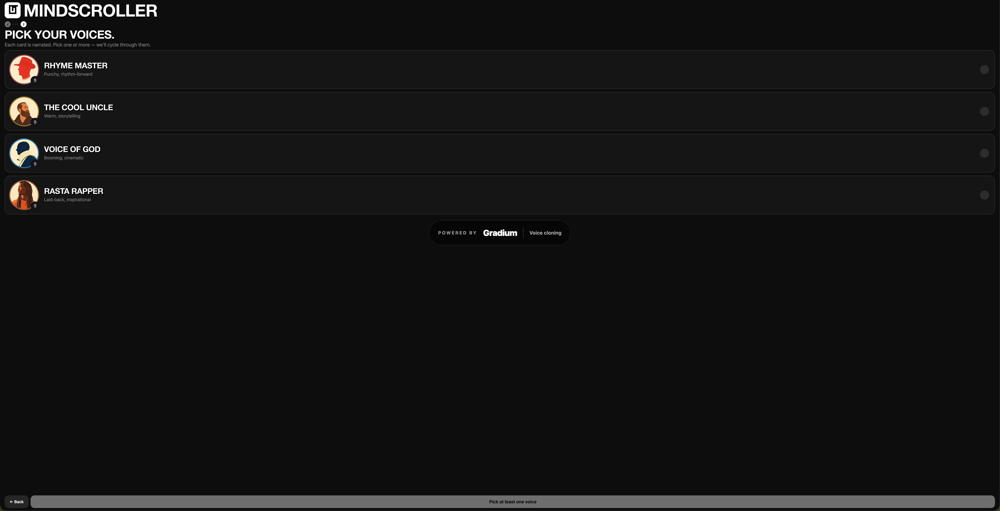

# mindscroller

A TikTok-style learning feed. Every card is fully generated on demand:
a 40–55 word script written by **OpenAI**, an editorial-illustration image
rendered by **fal.ai**, and a personality-cloned voiceover from **Gradium**.
The feed adapts to your watch / like / dislike behavior via a deterministic
agent loop you can audit live in the dashboard.

Hackathon submission — local-first (SQLite + local media files, no cloud DB).

**Demo video:** https://www.loom.com/share/4968c32d5be94236baef319fd6be18d4

---

## Partner technologies

| Partner       | Used for                                          | Touchpoint                                         |
| ------------- | ------------------------------------------------- | -------------------------------------------------- |
| **OpenAI**    | Script + visual hook + image-prompt authoring     | `backend/app/content/openai_client.py`, model `gpt-4o-2024-08-06` (structured output via `response_format=CardDraft`) |
| **fal.ai**    | Image generation from the model-authored prompts  | `backend/app/content/fal_client.py`, model `fal-ai/flux/schnell`, portrait 3:4, retry with safety-checker fallback |
| **Gradium**   | TTS voice cloning (personality voices)            | `backend/app/content/gradium_client.py`, WebSocket TTS via the official `gradium` SDK, account-wide semaphore at 2 concurrent |


### Voices

Defined in `backend/app/content/voices.py`. Four personality clones plus
the catalog default:

- **Wren** (catalog) — professional, polished baseline.
- **Rhyme Master** — punchy, rhythm-forward delivery.
- **The Cool Uncle** — warm, storytelling, smart-friend-at-a-bar tone.
- **Voice of God** — booming, authoritative, cinematic.
- **Rasta Rapper** — laid-back, inspirational, rapper cadence.

The onboarding voice picker lets the user choose one or more. The agent
cycles through those picks (round-robin, seeded by the user's total
interaction count) so the same voice never sits on every fresh card.

---

## Architecture

```
                  ┌────────────────────────────────────────────┐
                  │  OpenAI gpt-4o (structured output)         │
                  │  → CardDraft {                             │
                  │       visual_hook,                         │
                  │       script,                              │
                  │       image_prompt                         │
                  │     }                                      │
                  └─────────────────┬──────────────────────────┘
                                    │
                  ┌─────────────────┴──────────────────────────┐
                  ▼  asyncio.gather                            ▼
         ┌────────────────────┐                  ┌─────────────────────┐
         │ fal.ai             │                  │ Gradium TTS         │
         │ flux/schnell       │                  │ (WebSocket SDK)     │
         │ → PNG (3:4)        │                  │ → WAV               │
         └──────────┬─────────┘                  └──────────┬──────────┘
                    └────────────────┬──────────────────────┘
                                     ▼
                       ┌─────────────────────────────┐
                       │ SQLite cards row +          │
                       │ media/img + media/audio     │
                       └─────────────┬───────────────┘
                                     ▼
                       ┌─────────────────────────────┐
                       │ Vite + React feed UI        │
                       │ scroll-snap + Zustand store │
                       └─────────────────────────────┘
```

OpenAI is the **brain** — it authors the visual hook, the script, and the
image prompt in a single call. fal.ai and Gradium are dumb renderers that
consume the fields it produces.

---

## Setup

### Prerequisites

- **Python 3.13** (3.14 isn't yet supported by `pydantic-core`'s PyO3).
- **Node 20+** with `npm`.
- API keys for the three partners (set in `backend/.env`):

```
OPENAI_API_KEY=sk-...
FAL_KEY=...
GRADIUM_API_KEY=...
GRADIUM_VOICE_ID=RhI-l8fGE2DtXgXV   # Wren — used as the default catalog voice
```

A starter `.env.example` is committed; copy it to `.env` and fill in
the keys.

### Backend

```bash
cd backend
python3.13 -m venv .venv
source .venv/bin/activate
pip install -e .
cp .env.example .env   # fill in OPENAI_API_KEY, FAL_KEY, GRADIUM_API_KEY
```

SQLite + media directories are created automatically on first boot —
no migration step needed.

### Frontend

```bash
cd frontend
npm install
```

---

## Run

Two terminals. The Vite dev server proxies `/api` and `/media` to the
backend so the browser sees them on a single origin.

**Terminal A — backend** (port 8000):

```bash
cd backend
source .venv/bin/activate
uvicorn app.main:app --reload --reload-dir app --port 8000 --log-level info
```

`--reload-dir app` is important: without it `uvicorn` watches `.venv`
and loops forever whenever pip writes a cache file.

**Terminal B — frontend** (port 5173):

```bash
cd frontend
npm run dev
```

Then open:

- **App:** http://localhost:5173
- **Prompt workbench (dev tool):** http://localhost:8000/workbench
- **Card preview:** http://localhost:8000/preview

---

## Screenshots

**Onboarding — pick what you want to learn.** Each tile is a category in
the static taxonomy; the illustrations are AI-generated and shared with
the dashboard ranking flags so the visual language stays consistent.


**Onboarding — pick your voices.** Each option carries a Gradium-cloned
personality; the agent cycles round-robin through the user's picks when
generating cards. The big pill at the bottom calls out the voice cloning
partner.



**Feed + live dashboard.** The portrait card on the left is the active
TikTok-style item (visual hook overlaid in CSS, narration auto-playing,
"JUST GENERATED FOR YOU" badge when it came from the GENERATE button).
The dashboard on the right ranks categories by affinity in real time and
shows the exact four cards the agent will produce next if you click
GENERATE NEW CONTENT.


